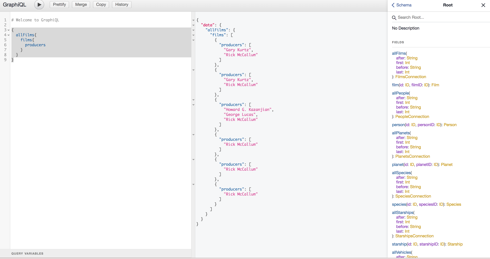

# + Django GraphQL API

    + GraphQL IDE to execute queries :
    -> https://graphql.org/swapi-graphql/

    + The API that will be used by the IDE (Starwar Movies):
    -> https://swapi.dev/

    + REST vs GRAPHQL :

    * Problem with REST endpoints is that, data getting from this endpoint is huge and sometimes we don't need all the attributes
      so this is why GRAPHQL came to fix this problem of over-fetching with it's query language and request just the data needed,
      trying to minimize data loading and providing a flexibility that doesn't exist in REST concept.

    #Example :

    - Run this REST query to get all films :
    -> https://swapi.dev/api/films/

    - Run this GRAPHQL query to get all films is producer :

    ->  {
          allFilms{
            films{
              producers
            }
          }
        }

### - Checking the type schema of data stored in the database (go to https://graphql.org/swapi-graphql/ and click on docs) :

    + Query Starwar films using arguments :

        *go to the schema explorer, you will get all objects with there methods and arguments and types of return :

        - Example / to get a film by 'filmID' :

        -> film(id: IDfilmID: ID): Film

        {
          film(filmID: "1") {
            title
            episodeID
          }
        }

### - CRUD Operations using GraphQL Mutations :

    -> IDE used for thsi example - https://graphql-sample.herokuapp.com/playground :

    + Example - addPosts :

    mutation { #1
      addPost(title: "hello world", body: "learn how to learn"){ #2
        body #3
      }
    }

    #1 a CRUD operation is always started with the keyword mutation like the example above.
    #2 arguments needed to create a new post.
    #3 the attribute fetched to show if the record has been created successfuly.

    + Use variables in mutations queries :

    mutation($title: String!, $body: String!) {
      addPost(title: $title, body: $body){
        body
      }
    }

    # {
        "title": "hello world",
        "body": "learn how to learn"
      }

### - Create a small backend using django and graphene :

    $ pip3 install pipenv
    $ pipenv shell
    $ pipenv install graphene
    $ exit

    + snakecase vs CamelCase :

    # if we enter is_admin attribute in the schema to see if admin or not we will have an error,
    # instead we should change is_admin to isAdmin (CamelCase) without that, it won't work.

    -> check schema.py for more info.

    or (Alternative)

    schema = graphene.Schema(query=Query, auto_camelcase=False)

    -> auto_camelcase when it's on False, so all queries should be written in snakecase.
    -> so is_admin won't got you errors.

